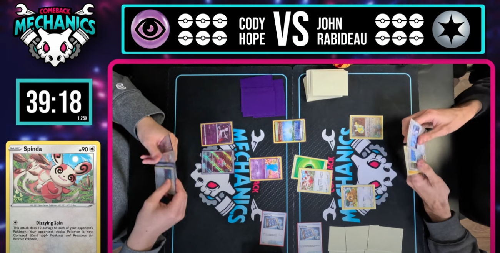

# About Us

We are a North Texas based Pokémon TCG team. We are both a social club and compete in local/regional events. We meet weekly to test new deck archetypes, prepare for our next big event or host our own mini tournaments.

 

## Our Logo

Designed by Omar and Maverick. We play on the name "mechanics" which describes a way the cards interact with the game, like an Ace in a game of Blackjack can either be 1 or 11. Comeback mechanics are found in many trading card games and are `known combinations or single cards that assist players to turn a game around`. Combining this name and its implied visuals with a "punk rock" feel of cute skull made the whole logo come together.

 

## Founding Members

=== "Omar"

	Fun Facts: 
	
	- been playing for 3 years
	- also plays Lorcana

=== "Maverick"

	Fun Facts: 
	
	- been playing for 6 years
	- avid fan of Marvel Snap
	
=== "Chris"

	Fun Facts: 
	
	- been playing for 6 years
	- Made Day 2 twice at Pokemon Regionals

 

## Social Channels

:material-twitter: [@comebackmechs](https://x.com/comebackmechs/)

:material-youtube: [@comebackmechs](https://www.youtube.com/@ComebackMechs)

 

_One of our recently created videos showcasing our finals match from the last tournament._

  