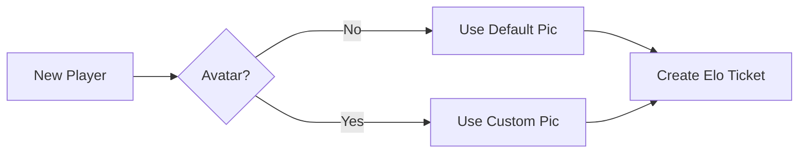

# Code Overview

Let's look at the functionality and code for each page

 

## Flows

### Player Creation Flow

`CM_Create_ELO_Rank`

- Object: `CM_Players__c`
- Trigger: A record is created

Before a player appears on the leaderboard, they must be created in Salesforce by the Admin, Omar Pastrana. When the `CM_Players__c` record is created, 

