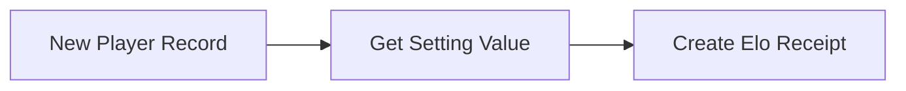

# Code Overview

Let's look at the functionality and code for each page

<br>

## Flows

### Player Creation Flow `CM_Create_ELO_Rank`

- Object: `CM_Players__c`
- Trigger: A record is created

Before a player appears on the leaderboard, they must be created in Salesforce by the Admin, Omar Pastrana. When the `CM_Players__c` record is created, the flow pulls in the Elo `Starting_Value__c` from the `CM_Setting__mdt`. This is used to create the first Elo Receipt record



<br>

## Lightning Web Components

### Wrapper LWC

#### `cmWrapper getModel`

This method is called in the `connectedCallback` method and pulls the necessary information from the database. Once the result is brought in, it is processed. Each child component inside will be given the correctly processed data.

```js
getModel() {
    this.loading = true;
    getViewModel()
		.then((result) => {
			this.outboundModel = Object.assign({}, result.outboundModel);
		})
		.catch((error) => {
			this.handleError(error);
		})
		.finally(() => {
			this.allPlayers = this.buildAllPlayers(this.outboundModel.allPlayers);
			this.allPlayerOptions = this.buildAllPlayerOptions(this.outboundModel.allPlayers);
			this.allTagChallenges = this.buildAllTagChallenges(this.outboundModel.allTagChallenges);
			this.metadataConstants = this.outboundModel.metadataConstants[0];
			
			this.loading = false;
			this.setNav("leaderboard");
		});
}
```

<br>

#### `cmWrapper buildAllTagChallenges`

An example of the processing methods in the `getViewModel` where the data is dissected, new values created and all packaged for the next component. 

```js
buildAllTagChallenges(arr) {
    let tempArray = [];
    arr.forEach((row) => {
		let tempObj = {};

		tempObj.Id = row.Id;
		tempObj.date = this.flipDate(row.CM_Date_of_Event__c);
		tempObj.winner = row.CM_Winning_Player__r.Name;
		tempObj.winnerId = row.CM_Winning_Player__c;
		tempObj.winnersRank = row.CM_Winning_Player_s_New_Rank__c;
		tempObj.winnerOrdinal = h.getRankNumber(row.CM_Winning_Player_s_New_Rank__c);
		tempObj.loser = row.CM_Losing_Player__r.Name;
		tempObj.loserId = row.CM_Losing_Player__c;
		tempObj.losersRank = row.CM_Losing_Player_s_New_Rank__c;
		tempObj.loserOrdinal = h.getRankNumber(row.CM_Losing_Player_s_New_Rank__c);
		tempObj.CM_Defended_Tag__c = row.CM_Defended_Tag__c;

		//Elo strings
		tempObj.winnerEloString = `${row.CM_Winning_Player_s_Previous_Elo__c} (+${row.CM_Winning_Players_Elo_Change__c})`;
		tempObj.loserEloString = `${row.CM_Losing_Player_s_Previous_Elo__c} (${row.CM_Losing_Players_Elo_Change__c})`;

		tempArray.push(tempObj);
    });
    return tempArray;
}
```

<br>

### Tag Challenge LWC

#### `cmTagChallenge handleSubmitClick`

As the user interacts with the inputs of the UI, the values are updated to the `tagRecordWrapper` variable so it can be passed into the `createTagChallenge` apex implicit call. Once the call is complete, the UI is refreshed by calling `refreshScores` and sending the custom event up to the parent component `cmWrapper`.

```js
handleSubmitClick() {
    this.deactivateSubmit = true;
    this.loading = true;
    this.checkRanksForPlayers();
    let expectedValues = this.calculateExpected(
      this.tagRecordWrapper.CM_Winning_Player_s_Previous_Elo__c,
      this.tagRecordWrapper.CM_Losing_Player_s_Previous_Elo__c
    );
    this.tagRecordWrapper.CM_Winning_Players_Elo_Change__c = this.calculateEloChange(1, expectedValues.winner);
    this.tagRecordWrapper.CM_Losing_Players_Elo_Change__c = this.calculateEloChange(0, expectedValues.loser);

    this.receipt.winningPlayerId = this.tagRecordWrapper.CM_Winning_Player__c;
    this.receipt.winningPlayerEloChange = this.tagRecordWrapper.CM_Winning_Players_Elo_Change__c;
    this.receipt.losingPlayerId = this.tagRecordWrapper.CM_Losing_Player__c;
    this.receipt.losingPlayerEloChange = this.tagRecordWrapper.CM_Losing_Players_Elo_Change__c;
    
    createTagChallenge({ tc: this.tagRecordWrapper, r: this.receipt })
		.then((result) => {
			this.message = result;
			this.error = undefined;
			this.scoreSubmitted = true;
		})
		.catch((error) => {
			this.message = undefined;
			this.error = error;
			this.errorSubmitting = true;
		})
		.finally(() => {
			this.refreshScores();
		});
}
```

<br>

## Apex Classes

### Controller Class

#### `CM_Controller.createTagChallenge`

This method is invoked by the LWC at the time of Match Result creation. The LWC provides the necessary properties after the player inputs them into the component. Then end result is 1 `CM_Tag_Challenge__c` record and 2 `CM_Elo_Receipt__c` records, one for each player involved.

```java
@AuraEnabled
public static CM_Tag_Challenge__c createTagChallenge(CM_Tag_Challenge__c tc, Receipt r) {
    if (tc != null) {
      insert tc;
    }
    List<CM_Elo_Receipt__c> receipts = new List<CM_Elo_Receipt__c>();

    //? insert Player A ELO receipt
    CM_Elo_Receipt__c winnerEloReceipt = new CM_Elo_Receipt__c();
    winnerEloReceipt.CM_ELO_Change__c = r.winningPlayerEloChange;
    winnerEloReceipt.CM_Player__c = r.winningPlayerId;
    winnerEloReceipt.CM_Tag_Challenge__c = tc.Id;
    receipts.add(winnerEloReceipt);

    //? insert Player B ELO receipt
    CM_Elo_Receipt__c loserEloReceipt = new CM_Elo_Receipt__c();
    loserEloReceipt.CM_ELO_Change__c = r.losingPlayerEloChange;
    loserEloReceipt.CM_Player__c = r.losingPlayerId;
    loserEloReceipt.CM_Tag_Challenge__c = tc.Id;
    receipts.add(loserEloReceipt);

    insert receipts;
    return tc;
}
```

<br>

#### `CM_Controller.getViewModel`

This method passes all the needed information from the database to the frontend LWC. This is accomplished by using a [ViewModel](https://en.wikipedia.org/wiki/Model%E2%80%93view%E2%80%93viewmodel) pattern. All data is retrieved, bundled and sent to the LWC by using this one method.

```java
@AuraEnabled
public static ViewModel getViewModel() {
    ViewModel vm = new ViewModel();
    vm.outboundModel = new OutboundViewModel();
    return vm;
}

public class ViewModel {
    @AuraEnabled
    public OutboundViewModel outboundModel;
}

//? data coming out of the database
public class OutboundViewModel {
    @AuraEnabled
    public List<CM_Tournament_Result__c> allTournamentResults;

    @AuraEnabled
    public List<CM_Players__c> allPlayers;

    @AuraEnabled
    public List<CM_Tag_Challenge__c> allTagChallenges;

    @AuraEnabled
    public List<CM_Settings__mdt> metadataConstants;

    public OutboundViewModel() {
      this.allTournamentResults = getAllTournamentResults();
      this.allPlayers = getAllPlayers();
      this.allTagChallenges = getAllTagChallenges();
      this.metadataConstants = getMetadataConstants();
    }
}
```

<br><br>