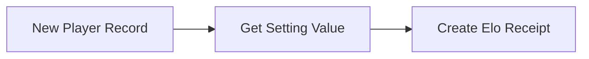

# Code Overview

Let's look at the functionality and code for each page

<br>

## Flows

### Player Creation Flow `CM_Create_ELO_Rank`

- Object: `CM_Players__c`
- Trigger: A record is created

Before a player appears on the leaderboard, they must be created in Salesforce by the Admin, Omar Pastrana. When the `CM_Players__c` record is created, the flow pulls in the Elo `Starting_Value__c` from the `CM_Setting__mdt`. This is used to create the first Elo Receipt record



<br>

## Apex

### Controller Class `CM_Controller.cls`

#### `createTagChallenge`

This method is invoked by the LWC at the time of Match Result creation. The LWC provides the necessary properties after the player inputs them into the component. Then end result is 1 `CM_Tag_Challenge__c` record and 2 `CM_Elo_Receipt__c` records, one for each player involved.

```java
@AuraEnabled
public static CM_Tag_Challenge__c createTagChallenge(CM_Tag_Challenge__c tc, Receipt r) {
    if (tc != null) {
      insert tc;
    }
    List<CM_Elo_Receipt__c> receipts = new List<CM_Elo_Receipt__c>();

    //? insert Player A ELO receipt
    CM_Elo_Receipt__c winnerEloReceipt = new CM_Elo_Receipt__c();
    winnerEloReceipt.CM_ELO_Change__c = r.winningPlayerEloChange;
    winnerEloReceipt.CM_Player__c = r.winningPlayerId;
    winnerEloReceipt.CM_Tag_Challenge__c = tc.Id;
    receipts.add(winnerEloReceipt);

    //? insert Player B ELO receipt
    CM_Elo_Receipt__c loserEloReceipt = new CM_Elo_Receipt__c();
    loserEloReceipt.CM_ELO_Change__c = r.losingPlayerEloChange;
    loserEloReceipt.CM_Player__c = r.losingPlayerId;
    loserEloReceipt.CM_Tag_Challenge__c = tc.Id;
    receipts.add(loserEloReceipt);

    insert receipts;
    return tc;
}
```

<br>

#### `getViewModel`

This method passes all the needed information from the database to the frontend LWC. This is accomplished by using a [ViewModel](https://en.wikipedia.org/wiki/Model%E2%80%93view%E2%80%93viewmodel) pattern. All data is retrieved, bundled and sent to the LWC by using this one method.

```java
@AuraEnabled
public static ViewModel getViewModel() {
    ViewModel vm = new ViewModel();
    vm.outboundModel = new OutboundViewModel();
    return vm;
}

public class ViewModel {
    @AuraEnabled
    public OutboundViewModel outboundModel;
}

//? data coming out of the database
public class OutboundViewModel {
    @AuraEnabled
    public List<CM_Tournament_Result__c> allTournamentResults;

    @AuraEnabled
    public List<CM_Players__c> allPlayers;

    @AuraEnabled
    public List<CM_Tag_Challenge__c> allTagChallenges;

    @AuraEnabled
    public List<CM_Settings__mdt> metadataConstants;

    public OutboundViewModel() {
      this.allTournamentResults = getAllTournamentResults();
      this.allPlayers = getAllPlayers();
      this.allTagChallenges = getAllTagChallenges();
      this.metadataConstants = getMetadataConstants();
    }
}
```

<br><br>