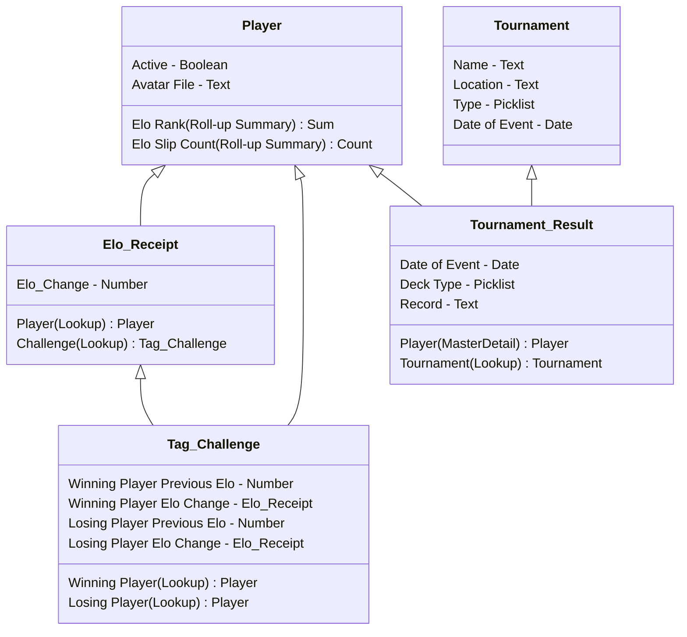

# Data Schema Overview

## Object Descriptions

How do all these custom objects interact with each other?

| Label | API Name | Description |
|---|---|---|
| Player | `CM_Players__c` | Main object used to collect the data from the other objects. Uses roll-up summaries to gather essential information from other objects|
| Elo Receipt | `CM_Elo_Receipt__c` | These are created to track the ups and downs associated with the player rankings. Each Tag Challenge creates one for each player.|
|Tag Challenge|`CM_Tag_Challenge__c`| These are created by the players thru the mobile site. Once created, an associated Elo Receipt is made for each player to track their Elo change.|
|Tournament Result|`CM_Tournament_Result__c`| [Junction Object](https://www.salesforceben.com/what-is-a-junction-object-in-salesforce/) that connects the Player to the Tournament. This allows for cross object relationships.|
|Tournament|`CM_Tournament__c`|Created on the backend by the Admin to later associate with Tournament Results.|
|Setting|`CM_Setting__mdt`|This record, named "Default", holds information for how the application should be run. Ex: Elo Starting Value|

  

## Schema Relationship Diagram

  