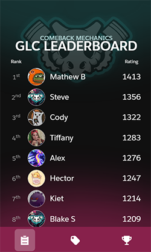
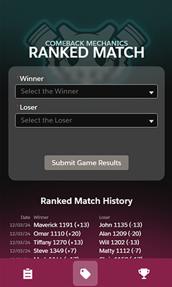
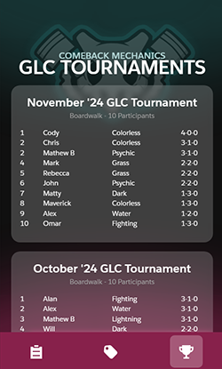

# Home

## Overview

A custom mobile site built on the Salesforce platform. This is used for weekly game play results tracking by individual users. Tournament results and stats are updated to the site by the Admin, Omar Pastrana.

 

## What the site does

=== "Elo-based Leaderboard"

	

	Players and avatars are set up by the Admin, Omar Pastrana, behind the scenes. Players begin with a `1200` Elo score and rankings are established using the [Elo rating system](https://en.wikipedia.org/wiki/Elo_rating_system). This system is commonly used in Chess and ESports.

	- A player's Elo rating increases if they win games, and decreases if they lose. 
	- A player's Elo rating also increases if they beat a higher-ranked player. 

	
=== "Match Result Entries"

	

	The winning player enters their results on the Ranked Match tab. This adjusts the ratings for each player involved in the match. This can be found in the History section.
	

=== "Tournament Results"

	
	
	This tab highlights all the recent Tournament Results. This information can also be found on the Leaderboard Tab where it is specific to the player selected.

	- Highlights which deck archetypes are most successful
	- Helps plan for attendance at the next month's event
	

  